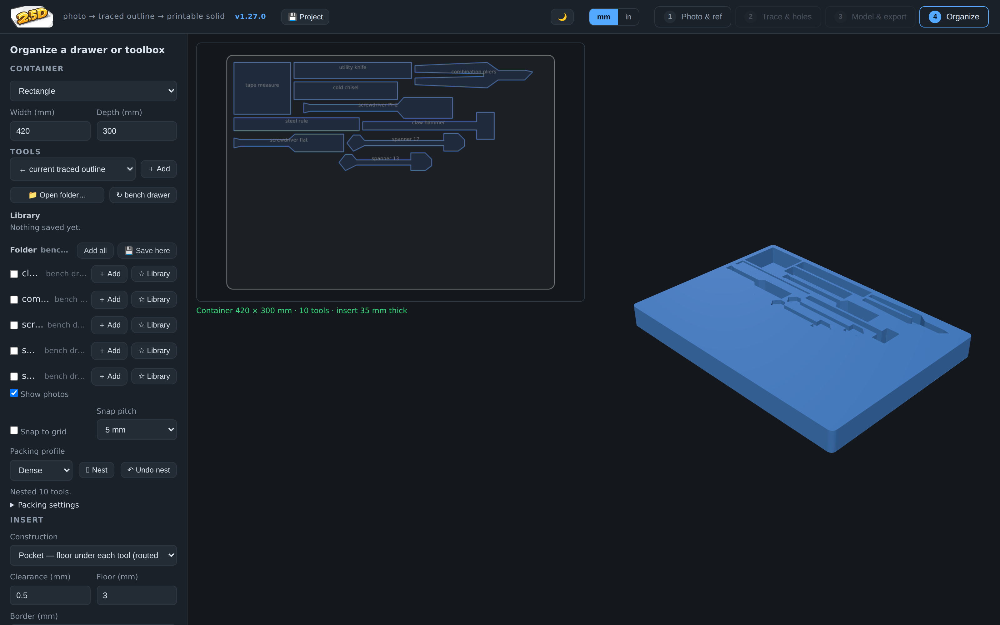
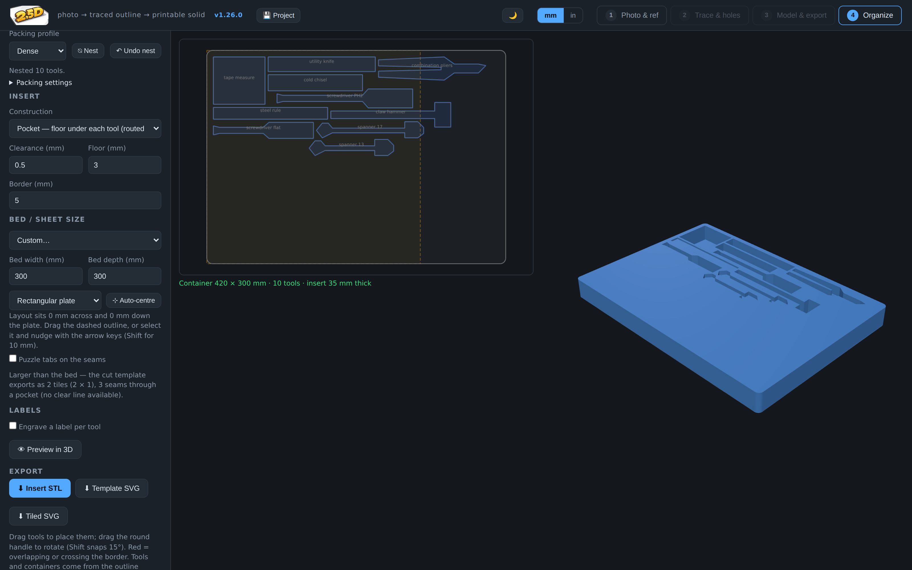

# 2.5D — photo → traced outline → printable solid

Take a picture of an object lying on a sheet of paper, type in the object's
thickness, and get a 3D-printable STL back.

The paper is the trick: its size is known (A4, US Letter, any ISO sheet, or a
custom size), so once you mark its four corners the app removes the camera's
perspective and skew with a homography and knows the real size of every pixel.
The object is then traced automatically at millimetre scale, you clean up the
trace and add holes, and the outline is extruded by the thickness — with
optional chamfers or fillets on the top and bottom edges.

Tools like TraceFinity go the other way — scanning an object to carve a
matching *cutout* (for foam inserts, organizers). This app is the opposite: it
builds the **positive solid** of the object itself, so you can reprint a flat
part, a bracket, a gasket, a game piece, a knob backplate…

Everything runs in the browser. No server, no build step, no uploads — your
photo never leaves your machine.

| 1 — Photo & paper | 2 — Trace & holes | 3 — Model & export | 4 — Organize |
| --- | --- | --- | --- |
|  |  |  |  |

## Running it

**No hosting needed** — grab [`dist/2.5d-local.html`](dist/2.5d-local.html)
(one self-contained ~1.2 MB file, everything inlined) and double-click it. It
runs entirely offline; rebuild it after source changes with `npm run build`.

For development, the un-bundled source needs a static server (browsers block
ES modules over `file://`):

```sh
cd 2.5D
python3 -m http.server 8000     # or: npx serve .
# open http://localhost:8000
```

### Hosting on GitHub Pages (optional)

GitHub Pages serves a repo's files as a website, free, straight from GitHub —
no server of your own, and since this app is plain static files with no build
step, it works as-is:

1. On GitHub open **Settings → Pages** for this repository.
2. Under **Build and deployment**, set **Source** to *Deploy from a branch*,
   pick the branch (e.g. `main` after merging) and folder **/ (root)**, and
   save.
3. After a minute the site is live at `https://<user>.github.io/<repo>/`
   (for this repo: `https://zillaness.github.io/2.5D/`). Every push to that
   branch redeploys automatically.

Notes: the site URL is public to anyone who has it (Pages from a free-plan
repo is always a public site), but that only exposes the app itself — photos
are processed entirely in the visitor's browser and never uploaded anywhere.
If you'd rather not publish at all, the single-file `dist/2.5d-local.html` is
the fully offline option.

## Workflow

**1 — Photo & reference.** Load a photo (file picker or drag & drop) and pick a
**reference** to set real-world scale:

- **Rectangle** — a sheet of paper (defaults to US Letter), or a
  **credit/ID card** or a **banknote** you always have on hand. Currency is
  grouped into submenus in the picker (US & Canadian bills, euro €5–€100, UK
  £5–£50, Australian $5–$100) so the list stays tidy. Corners are auto-detected;
  drag the four handles to fine-tune (a magnifier loupe appears while dragging,
  the yellow edge marks the top). A rectangle corrects perspective and skew
  exactly.
- **Graph paper / dot grid / cutting mat** — calibrate off a printed grid
  instead of the sheet's edges. Pick the pitch (metric 1–10 mm, imperial
  1/10–1 in, cutting-mat presets, or a custom one) and put the four handles on
  grid intersections or dots — **the squares they span are counted for you**
  (type the counts to override). Corrects perspective exactly, and the sheet's
  edges never have to be in frame — so it suits objects bigger than the paper,
  or laid across two sheets. See "Graph paper, dot grids & cutting mats" below.
- **Scale bar** — the universal manual override: drag a bar's two ends onto
  any two points a known distance apart (the 0 and 30 cm marks on a mat's
  ruler, a tape measure, a part you've measured) and type the distance
  (mm or inches). Scale only, like the coin, so shoot straight down.
- **Coin** — scale only. Drag a circle over a coin (US, Canadian, euro, UK, or
  Australian — grouped by country in the picker, round denominations only — or a
  custom diameter) and its edge handle to the rim. Shoot straight down,
  since a coin can't correct perspective. Best for small objects where a full
  sheet of paper is overkill.

A **Rotate photo** control uprights a sideways shot in 90° steps (the corners
rotate with it). Or skip the photo entirely and **import a vector drawing** —
see below.

**Capture area — object larger than / beside the reference.** By default the
rectified image is cropped to the reference rectangle, so the object has to sit
*on* it. Set **Capture area** to *Extend* and the perspective-corrected plane
grows beyond the reference, so a small card can calibrate a big object that
overhangs it — or one placed beside it — with full perspective correction, not
just scale. Keep the object on the **same flat surface** as the reference and
all four reference corners **visible**. The segmenter then treats both the paper
*and* the surrounding surface as background (so it still finds the object), and
any area outside the photo comes back as a black no-data border. It's less
forgiving than a reference the object fits on — a bigger sheet is still best
when you have one — but it beats being limited to the paper's footprint.

### Import a CAD drawing (DXF / SVG)

Step 1 has an **Import CAD file** button: drop a `.dxf` or `.svg` and its
geometry lands straight in the trace at true scale (units come from the file —
DXF `$INSUNITS`, SVG `width`/`viewBox`). Segments are stitched into closed
loops, obvious annotation layers/linetypes (dimensions, centre/hidden lines,
hatching, title block) are filtered out, and the outer boundary + holes are
detected automatically. Curves come in as curves: DXF `ARC`/`CIRCLE`/`ELLIPSE`
**and polyline vertex bulges**, plus SVG `A` arcs and `<circle>`/`<ellipse>`,
are all flattened — so a 2.5D SVG/DXF export (fillet arcs as bulges/`A`, holes
as true circles) re-imports as the same curved geometry, not faceted chamfers. A multi-view sheet shows a **view picker** — click the
plan/top view to use it. Everything then edits and exports like any other
trace. (`.dwg` is binary and unsupported — export it as DXF from your CAD app.)

**2 — Trace & holes.** The photo is rectified to a flat, true-scale image and
the object is segmented against the background colour. You get:

- **Detection threshold / noise cleanup** sliders (with Otsu auto-threshold),
  and a mask overlay toggle to see exactly what's being picked up.
- **Simplify** (Douglas-Peucker tolerance in mm) and **smoothing** (corner
  rounding) for the traced outline.
- **Rotate 90° left/right** — reorient the rectified image and all traced
  geometry together, handy when the shot came out sideways.
- **Lens distortion** — a slider (with an **Auto** button that reads the
  paper's edges) that straightens barrel/pincushion bowing so measurements stay
  accurate to the corners, not just the centre. See the note under Tips.
- **Hole detection** — enclosed background regions become holes automatically.
- **Trace correction** — drag any vertex, click an edge to insert one,
  right/Alt-click (or Delete) to remove one, delete whole holes, and undo with
  Ctrl+Z.
- **Multi-select & run cleanup** — Ctrl/⌘-click points or Shift-drag a marquee
  to select several; drag the group to move it, Delete to remove it. On a
  selected run: **Fit arc** (least-squares circle → smooth arc with an editable
  radius), **Fit line** (straighten), **Tangent** (round a blunt/rough corner
  into a **live fillet arc** — see below), **Densify** (add points), **Reduce**
  (thin points).
- **Straighten (reversible)** — Ctrl-click any two points and **Straighten**
  collapses the run between them to a single straight segment, removing the
  in-between points but **stashing** them: **Restore points** brings them back.
  The result is a managed straight line (tinted), which pairs with the tangent
  constraint below.
- **Live tangent fillets** — the **Tangent** button turns a selected corner run
  into a first-class fillet arc that *stays* tangent to both adjacent edges as
  you edit: drag a neighbouring vertex, or apply an H/V/perpendicular
  constraint to an adjacent edge, and the fillet re-derives itself to keep
  meeting both edges cleanly. Its radius is editable (and shown in the arc
  field), and **Release** turns it back into plain, independently-editable
  points. Any edit that reaches inside the fillet's run also releases it
  automatically. Fillets are saved with projects and library outlines. (Under
  the hood the arc is stored symbolically — corner + radius — and rasterised to
  points only for the mesh/export, so the solid pipeline is unchanged.)
- **Normalize traced holes** — an explicit button (never automatic) replaces a
  photo-detected hole with a least-squares fitted perfect circle, which is then
  draggable and editable like any placed hole; "All round holes" converts every
  round-ish one at once.
- **Detect fillets** — the outline counterpart: scans the outline, traced holes
  and sections for cleanly-rounded corners (e.g. from an imported drawing, or a
  2.5D arc re-imported from DXF/SVG) and converts each into a **live fillet arc**
  entity — so imported curves become editable and re-export as true arcs.
  Conservative by design: only well-fitting circular runs bracketed by straight
  edges are converted, so sharp corners and noisy traces are left alone. Traced hole loops can also be dragged whole, and the
  vertex control points can be toggled on/off.
- **Screw holes** — click to place round holes (or **click-drag to size one on
  the spot**; a floating ⌀ box appears right at the hole for typing the exact
  value), then give each one a type:
  - **Through**, **blind** (flat-bottom pocket with a depth), **countersunk**
    (cone for flat-head screws) or **counterbored** (cylindrical recess for
    socket-head screws), each from the **top or bottom** face.
  - Pick a screw from the built-in **metric (M2–M10) or SAE (#2-56–3/8-16)
    table** and a fit, and the bore is sized with the print-friendly
    **±½-pitch rule**: *clearance* = nominal + ½ pitch (screw slides through),
    *thread-into-print* = nominal − ½ pitch (the screw cuts its own thread).
    That's deliberately looser than a machinist's tap drill (nominal − pitch):
    a tap cuts clean threads, a screw biting into printed plastic needs more
    room. The computed ⌀ is shown with its math and stays editable.
  - Countersink ⌀/angle (90° metric, 82° SAE) and counterbore ⌀/depth are
    seeded from head dimensions with printing clearance — all editable.
  - **Heat-set inserts** (M2–M8): pick the size and the hole becomes a blind
    pocket at the recommended melt-in diameter and depth (from a brass-insert
    table, not the screw-bore rule) — editable, since values vary by brand.
  - Each hole's **rim** can also get its own edge break — square, **chamfer**
    (45°) or **fillet** (quarter-round) with a size in mm, independently at the
    top and bottom face. Rows appear only where the hole actually opens (a
    blind hole has one rim; a countersink already breaks its own face's edge).
    Handy for de-burring-style chamfers on print-facing holes or a soft fillet
    where a strap or cable passes through.
  - Newly placed holes copy the last one you edited, so a row of identical
    screw holes takes one setup. Position and every dimension can also be
    typed exactly in mm.

**Measure — 📏.** Read dimensions straight off the photo instead of exporting
to a slicer to check them. The measure tool snaps to corners, edge midpoints,
hole centres and points-on-edges; what you pick decides what you get:

- **Two points** — straight-line distance, with Δx/Δy in the panel.
- **Point + edge** — perpendicular distance (edge offsets, wall thicknesses).
- **One edge** (click it twice, or once then empty space) — its length.
- **Two edges** — the angle between them; near-parallel edges (< 5°) also
  report the **face-to-face gap**, like a caliper across two faces.
- **A hole** (traced or placed) — radius and ⌀ via least-squares circle fit.

The panel always shows the part's overall W×H, outline perimeter and area.
Measurements persist as on-canvas annotations that **live-update as you edit
the trace**, are deletable one-by-one, and follow the mm/in toggle.

**Constraints — ⊾.** Square up a traced outline instead of nudging vertices by
eye. Pick one or two entities (corner, edge, hole), then apply:

- **H / V** — force an edge horizontal or vertical.
- **⊥ Perpendicular / ∥ Parallel / = Equal length / ⋯ Collinear** — between
  two edges.
- **◎ Concentric** — two placed holes share a centre.
- **◠ Tangent to ⌀/arc** — pick a straight edge + a hole/circle **or a fillet
  arc (corner radius)** and the edge is driven tangent to it (its distance to
  the centre equals the radius), re-solving live as you move things. Click
  anywhere on a fillet to pick it as the tangent target.
- **Length… / Angle… / Distance…** — dimension constraints with a typed value
  (prefilled with the current measurement): fix an edge's length, the angle
  between two edges, or the distance point↔point / point↔edge /
  **hole-centre↔edge** — the way to locate a hole exactly off a datum edge.
- **⚓ Anchor** — pin a point so the solver moves everything else around it.

Constraints stay active: drag any point and a dashed **ghost preview** shows
where the solver will put the geometry; release to commit. They're listed in
the panel with per-item delete, survive undo, and are saved with projects and
library outlines. (The solver is an iterative projection pass — conflicting
constraints settle on a compromise rather than erroring.)

**Units** — display defaults to millimetres with an mm/in toggle in the
header, but every dimension field parses any unit regardless of the toggle and
converts to mm: `12.7`, `12,7` (comma decimal), `.5"`, `1/2 in`, `1 1/2"`,
`3/8"`, `12 mm`, `1.2 cm`, `0.3 m`, `2 ft`, and feet-inches like `1' 6"` or
`1 ft 6-1/2 in`.

**Projects** — the 💾 Project button (header) saves or restores everything:
the reference/paper settings, corners (or coin), the trace with all holes and
sections, and the rectified image, as a JSON file or via copy/paste. That copy/paste path matters in embedded
views that block file downloads (the Claude artifact does): copy the project
there, paste it into the offline `dist/2.5d-local.html` or a hosted copy, and
export from that — no re-tracing.

**3 — Model & export.** Enter the thickness, choose an edge style for the top
and bottom edges — square, chamfer (45°) or fillet (quarter-round) with a size
in mm — and preview the solid in 3D.

**Sections — different thicknesses & overhangs.** The model isn't limited to
one height. Draw extra sections with the **▱ Section** tool in step 2 (click
points, double-click or Enter to close), then give each its own **thickness**
and **floor offset** in step 3: a raised boss on a thinner plate, a stepped
part, or an overhang that floats above the build plate (floor offset > 0 —
your slicer will want supports if nothing is underneath). Each section is a
watertight shell; overlapping sections are exported together and every slicer
unions them. **Bed-level sections (floor offset 0) are clipped to the object
outline** — they re-thickness the part but can't add material beyond its
silhouette, so a roughly-drawn section never leaves stray tabs. A section with
a **floor offset > 0 keeps its full footprint** (it's treated as a deliberate
overhang/cantilever that may reach past the outline); you'll see a warning if a
bed-level section spilled over and was trimmed. Screw holes cut through every section they pass through, and the
countersink/counterbore/blind feature automatically lands on the true entry
face — the topmost section for "from top" holes, the bottommost for "from
bottom".

**Labels — emboss & deboss (🅰 Label).** Put a part number, a name or a mark on
a face. Click the part to place a label, **drag it anywhere**, and drag its round
handle to rotate to **any angle** (Shift snaps to 15°). Set the **cap height**,
the **depth** (how far it stands proud or sinks in), the face (**top or bottom**),
a font, and **Mirror** for stamps — bottom-face labels mirror by default so they
read correctly when you flip the part over. Text comes from the platform's own
fonts, so nothing is bundled and letter counters (the middle of *O*, *A*, *8*)
stay open.

- **Emboss** — each letter becomes its own raised prism seated on the face and
  trimmed to the part, unioned by your slicer exactly like overlapping sections.
- **Deboss** — carved as glyph-shaped blind recesses in a **single watertight
  shell**: vertical glyph walls, an exact-depth floor, letter counters left
  standing — the same construction as a blind screw hole, generalized to
  arbitrary outlines, still with no 3D boolean kernel involved. Each label
  gets its **own exact depth** (mixed depths on one face are fine).
  Countersinks, counterbores and blind holes now **keep their shape on the
  debossed face too**, as long as they sit clear of the lettering; a feature
  that overlaps a glyph (or a glyph crowding an edge chamfer/fillet) falls
  back to the previous two-layer split, demoting only that overlapping
  feature to a plain bore, with a warning.

Labels live in the trace overlay (green = emboss, orange = deboss) and are saved
with the project.

**Holders & organizers (step 3).** Instead of printing the object, print a
*home* for it. Pick **Foam-style insert** under *Holder / organizer* and the
3D view previews a rounded slab with the tool pocketed into the top:
**clearance** around the outline so it drops in, **pocket depth** (defaults
to the object's thickness), a **floor** beneath (0 punches the pocket
through), a **border** of slab material, and a **finger notch** on any edge
for lifting the tool out. Traced holes in the tool stay as **support
pillars** — they poke into the tool's own openings (a tape-roll core, a
wrench's hang hole) exactly the way letter counters stand in a debossed
label, and it's the same single-shell recess construction, so the insert is
one watertight mesh with an exact-depth floor. Export as **STL**, or as a
true-scale **cut template SVG** (slab + pocket + pillars) for cutting real
Kaizen foam on a laser or with a knife.

**Finger notches, placeable.** Every pocket can carry a finger notch and you
control where it sits: in the single-tool foam and Gridfinity modes pick an
edge or **Custom position…** and slide the notch anywhere around the outline
(live 3D preview); in the layout editor tick **Finger notch** on a selected
tool and **drag the amber marker** — it snaps to the pocket boundary
wherever you drop it, rides along with moves and rotations, and counts
toward collision/border checks (a notch pointing at a Gridfinity wall
flags red and bumps the bin size).

**Multi-tool drawer layouts.** Pick **Multi-tool drawer insert** to open the
layout editor: choose a container (a plain rectangle, or a **saved container
outline** — photograph the drawer itself on paper and save its trace), then
add tools from the **outline library** or drop in the currently traced
outline. Drag tools to place them, drag the round handle to rotate (Shift
snaps 15°); anything overlapping another pocket or crossing the border turns
red and blocks export until fixed. Each tool pockets at its **own depth**
(saved with the tool, overridable per placement — one insert can hold a
6 mm wrench next to a 2.5 mm ruler). Library entries now carry a **kind**
(tool / container) and their thickness. Preview in 3D, export the insert as
STL, or export the whole layout as a true-scale template SVG for cutting
foam. Layouts save with the project, geometry embedded, so they survive a
different browser.

**Bigger than your laser bed? It tiles.** A bench drawer is wider than any
laser, so set your **bed / sheet size** in the layout editor (presets for
common laser and printer beds, or custom) and the cut template exports as
**tiles that each fit the bed**, in one SVG laid out like a map of the
drawer — labelled A1, A2, B1… with dashed seam edges on a separate "marks"
layer you can engrave or ignore. Seams are straight (foam butts together in
the drawer) and are placed, within the window that keeps every tile on the
bed, where they cross the fewest pockets; the readout tells you whether
every seam found clear foam or how many had to pass through a pocket. Cut
one tile per bed load.

**Puzzle tabs.** Tick **Puzzle tabs on the seams** and each seam gets
jigsaw knobs on one tile with the matching sockets on its neighbour, so cut
foam locks together instead of just butting. Head diameter, neck, reach,
spacing and **fit** are yours: fit 0 is the exact negative; a laser kerf
loosens a knob-in-socket fit by roughly twice the kerf, so **−0.2** or so
gives foam a snug interference fit. Tabs keep clear of seam ends (where
seams cross) and of any pocket within reach, shifting along the seam to
find room; the readout counts the tabs and says if a seam segment was too
crowded for one. Tiles that give a knob are planned with the reach already
deducted (the last tile in a row or column only receives sockets, so it
keeps the full bed), which means every tile *with* its knobs still fits.

The STL still exports as one piece and warns when it's over the bed —
splitting a *printed* insert with registration features is a separate job,
not done yet.

**Gridfinity bins.** Pick **Gridfinity bin** and the tool pockets into a
spec-true bin on the 42 mm grid: footprint auto-snaps to the smallest
N×M·42−0.5 that fits the pocket plus minimum wall, height in 7 mm units
(auto from the pocket depth), the standard base profile per cell
(35.6 → 41.5 over 4.75 mm), an optional **stacking lip** (2.6 × 4.4,
default on) and optional **magnet holes** (⌀6.5 × 2.4 at 26 mm centres,
default off). Base pads, body-with-pocket and lip are built as
watertight lofts and prisms — no CSG kernel — and mate with standard
baseplates.

**Multi-tool Gridfinity bins (the foam hybrid).** In the layout editor,
switch the container to **Gridfinity bin (N×M cells)** — the same drag-and
-rotate layout then carves into a spec bin body instead of a flat slab:
every tool gets its own pocket depth, the bin's minimum wall is enforced as
the border, height auto-sizes in 7 mm units, and the lip/magnet toggles
follow the Gridfinity settings. That's Kaizen-style tool foam with a
Gridfinity base, from photos.

**Custom Gridfinity baseplates.** Pick **Gridfinity baseplate** with the
*drawer itself* traced (photograph the drawer bottom on/around paper —
beyond-paper capture helps) and get a baseplate in exactly that shape: spec
sockets on every full 42 mm cell that fits inside the outline, partial
cells left solid, a configurable floor underneath. Print it, drop it in
the drawer, snap standard bins onto it.

**Holsters & wall holders.** Pick **Holster** and the outline becomes a band
around the tool: **clearance** so it slides in and out, **wall** thickness,
**band height**, an optional **floor** (0 = open-through for long tools). A
**flat side** (any edge) gives a velcro-able face; **mounting** adds a back
plate — its own watertight shell extruded along the wall normal and rotated
into place, so the **keyhole tab** (nail/screw-head hang, slot upward) and
**screw wings** get real through-holes pointing into the wall with no 3D
booleans involved. Prints band-upright, plate vertical. That completes the
holders roadmap (`docs/holders-prd.md`) — every phase shipped without a CSG
kernel.

**Underside view — an optional fork after tracing (step 2).** Most objects
sit flat, so nothing ever asks you for a second photo. Once your outline is
finished, a **⤵ Add underside view…** button appears; take it only if the
part has recesses or overhangs on its bottom. (A single top-down photo
can't tell you whether it does — both faces share one silhouette — so
there's nothing honest to auto-detect here; it's your call.)

Taking the fork: flip the object over on the same paper, photograph it, and
the shot is corner-detected, rectified, **mirrored and aligned to the
outline you already traced** — the outline is *reused, never re-traced*, so
underside mode locks outline editing and leaves you just the ▱ Section
tool. **Draw the undercuts** — any section you draw here is created as an
undercut automatically (amber on the canvas, cyan being ordinary top-side
sections) — or let **▨ Suggest underside regions** propose them; nudge the
alignment (**180° / ±2° / Auto**) if a symmetric part lands rotated.
**✓ Done** returns to the top view.

Sections created this way are **underside sections**: instead of extruding,
they carve a bottom-face recess — you set the *off-bed depth* (how far that
area floats above the bed) in step 3, and the recess rides the same
single-shell machinery as deboss labels, so the part stays one watertight
mesh. Two flat photos still carry no depth: the back photo answers *where*,
the depth stays yours. The back photo and its alignment save with the
project.

**Suggest regions.** In step 2, **▨ Suggest regions** scans the photo for
visually-distinct areas inside the object — a boss catching the light, a
shadowed pocket, a differently-coloured pad — and drops each in as an **editable
section** (drag its control points like any trace). It's the footprint helper
for sections, the counterpart to hole-detection and Detect fillets: conservative
(only reasonably large, compact patches that stand out from the object's median
brightness), user-confirmed, and fully editable or deletable. Overlapping
bright/dark fragments of one feature are **deduped to a single suggestion**,
outlines are **smoothed** for easy editing, and patches over a hole are skipped.
Each is tagged **raised** (catches light) or a possible **recess** (shadowed) —
raised ones come in as a small boss above the base by default. **It can only
guess the *where*, never the *how tall*** — a single flat photo carries no depth,
so **you set the height / floor offset** in step 3 (taller = a raised boss; floor
offset > 0 = an overhang; a true recess is a deboss). For real auto-height you'd
need multiple views (photogrammetry — see the horizon).

**Export.** A binary **STL** (millimetres, z-up, centred at the origin), or
the outline as **SVG** or **DXF** at true scale (for laser cutting or CAD; the
2D exports use the base outline). The 2D exports are **arc-aware**: fillet arcs
come out as real arcs (SVG `A` commands, DXF polyline **bulges**) and screw
holes as true circles (SVG arc subpaths, DXF **CIRCLE** entities) instead of
many-sided polygons — cleaner geometry for a CAD or laser hand-off. An **export
quality** preset (coarse → extra fine) bundles the round-feature resolution and
curve-segment count. Every export carries the app version in its
header/metadata. The **💾 Project**
button also has an **outline library** that saves drawer/toolbox/tray outlines
to this browser for reuse (foundation for the upcoming foam/Gridfinity
exports).

**Graph paper, dot grids & cutting mats as the reference.** Pick **Graph
paper / dot grid / cutting mat** and calibrate off the printed grid instead
of the sheet's edges: choose the pitch — **metric** (1, 2, 2.5, 4, 5, 10 mm),
**imperial** (1/10, 1/8, 1/5, 1/4, 1/2, 1 in), a **cutting-mat** preset, or a
custom pitch — drop the four handles on four grid intersections (or dots)
that make a rectangle, and say how many squares they span. Line grids and
dot grids work identically.

**Cutting mats** deserve a word, because for most makers they're the best
reference in the house: big, dead flat, and already on the bench. They print
*two* pitches at once — 1 in majors over ½ in (or ⅛ in) minors, or 1 cm under
bold 5 cm — so count whichever squares you can see clearly; when the photo
reads back the *other* ruling of the same family, the check recognises it as
consistent rather than flagging a miscount (and a real off-by-one still gets
caught, since 9-for-10 lands on a ratio no ruling family produces). Their
dark surface segments a light object beautifully and a dark object poorly —
that's contrast physics, not a setting.

The point is that **the sheet's own edges never have to be in frame**, so
this handles objects bigger than the paper, objects lying across two sheets
taped together, or a shot cropped tight. Perspective is still corrected
exactly, because four known-spaced points is all a homography needs.

**You don't count the squares — the app does.** When you continue to the
trace, it rectifies at a provisional count, reads the grid's period straight
off the image, and derives how many squares the handles actually span (a
pure ratio, so the provisional guess drops out). Handles on real
intersections give whole numbers; if the reading isn't whole it says so and
suggests nudging the handles. On a cutting mat with bold majors over fine
minors it counts in the bold ruling — the one you'd name. Typing a count by
hand overrides the auto-count for that handle placement, and **⟲ Auto-count
squares** re-reads on demand.

For a cutting mat, put the handles on the *printed grid's outer corners* —
those are sharp and exactly the labelled size — rather than the mat's
physical edge, which is rounded and varies by brand.

Independently of the count, after rectifying, 2.5D measures the printed
pitch back out of the photo and tells you whether it agrees with the pitch
you chose: *"Grid checks out — printed pitch reads 4.98 mm"*, or
a warning with the ratio when it doesn't (counting 9 squares as 10 shows up
as a clean 111%). If the grid is too fine or washed out to read back, it
says so rather than staying quiet.

### Selecting points in the trace editor

Every cleanup tool acts on a selection, and a rectangle is the wrong shape for
most real outlines. The **⬚ Select** tool in step 2 draws the selection in one
of three shapes, picked in the **Selection** panel:

- **Box** is the rectangle the editor has always had, now with a direction.
  Dragged left to right it is a *window* and takes only what it fully
  encloses. Dragged right to left it is a *crossing* box, tinted green while
  you drag, and it also takes the whole run of any live fillet arc it touches
  plus any hole whose rim it cuts. Plain edges and managed straight lines are
  never selected by touch, so a crossing box over a straight run still takes
  only the points inside it.
- **Lasso** is a freehand loop. Everything inside the closed loop is selected,
  and a hole counts when its centre is inside. This is the quick way to take a
  screwdriver handle without taking the shaft next to it.
- **Brush** paints over points with a round brush. Any point within the radius
  of the path the cursor swept is selected, gaps between pointer events
  included, so one fast swipe along a dense edge catches the whole edge. The
  radius is a pixel slider, 4 to 60, and the ring under the cursor shows it at
  the current zoom. A click with no drag is a circle select.

The modifiers are the same in all three shapes: a plain drag replaces the
selection, **Shift** adds to it, **Alt** removes from it, **Escape** clears it,
and **Delete** removes the selected points and holes. Ctrl/⌘-click still
toggles one point at a time, and **Shift-drag in the ✎ Edit tool** still
selects, using whichever shape is currently picked, so the old habit keeps
working.

Holes now sit in the same selection as points. Dragging any selected point or
hole moves the whole group. The arc and line tools stay vertex-only and stay
disabled unless the selected points form a single run on one outline, which is
also why the lasso and the brush never quietly extend a selection to the unseen
end of a fillet the way a crossing box does.

The sub-mode and the brush radius last for the session and go back to Box and
12 px when the page reloads.

### Moving a label by hand

With labelling on, every placed tool gets a label centred under its own pocket,
and it tracks that pocket as the tool moves. Auto-placement is only a starting
point: drag the letters in the layout editor to put a label where you want it.
A round handle sits below the selected label, and dragging that turns it, with
Shift snapping the angle to 15 degree steps. Dragging a label also selects the
tool it names, so the panel on the left shows whose label is moving. A press
that lands on a tool always moves that tool, because dragging is the only way
to place one, so grab a label where it lies clear of the tools. On a layered
build, where labels sit inside their own pockets, that means the part of the
label sticking out past the pocket.

From then on your position wins. It is kept as an offset from the tool, so the
label rides along when the tool is moved or turned, and it survives a rebuild
of the layout and a re-nest. The same placement is what the cut template
engraves and what the printed insert debosses, and a label you drop on another
tool's pocket is reported in the labels readout rather than quietly moved. Press
**Auto** beside the label text to hand the label back to auto-placement. With
**Turn labels with their tool** on, your own turn is added to the tool's
rotation instead of replacing it.

Free-floating drawer labels such as "TOP DRAWER" drag and turn the same way.

## Tips for good photos

- Shoot from directly above, with the object roughly centred over the paper.
  The homography corrects perspective and skew exactly. Ordinary lens (radial)
  distortion — smallest near the image centre — is now correctable: nudge the
  **Lens distortion** slider in step 2 until the paper edges look straight, or
  press **Auto** to estimate it from those edges. Helps most with wide-angle /
  phone-macro shots and objects near the frame edge.
- Use flat, diffuse light. Hard shadows next to the object are the main cause
  of a fat trace; if a shadow gets picked up, raise the threshold or fix the
  outline by hand.
- Contrast matters: a dark or coloured object on white paper works best. A
  white object on white paper won't segment well.
- Keep the paper flat (tape the corners) and all four corners in frame.
- Only the outer silhouette is captured — this is a 2.5D tool. Internal
  pockets, steps, or overhangs need real CAD.

Accuracy on synthetic test images is ~0.1 mm; on real photos it's limited by
camera distortion, shadowing and how flat the paper is — expect a few tenths
of a millimetre with a careful photo.

### Laser-cut foam constructions

A router cuts a pocket into foam. A laser cuts through it. Step 4's **Insert**
options let you say which machine you are feeding, with a **Construction**
select:

- **Pocket** (the default, and what every older project loads as). A slab with
  the tools recessed into the top face, each to its own depth. This is the one
  to use for a CNC router or a 3D printer.
- **Through cut.** One sheet, every pocket a hole straight through it. The tool
  sits on whatever the drawer is lined with. **Top sheet (mm)** is the whole
  thickness.
- **Layered.** A through-cut top sheet glued onto a plain base sheet in a
  contrasting colour, which is the shadow-board look: a missing tool shows up
  as a bright silhouette. **Base sheet (mm)** sets the second sheet.

A laser cuts the whole depth of the sheet, so per-tool depths mean nothing
here. Both cut constructions ignore them and say so in the panel, and if a tool
is deeper than the top sheet the warning tells you it will stand proud. 2.5D
does not stack sheets for you; pick a thicker sheet or glue up a second one by
hand.

**Labels on the base.** With two layers, the base has no pockets, so a label
recess can go anywhere on it, including inside the pocket footprint. That is
the classic shadow-board label, and in a layered build it is the default: tool
labels centre themselves in their own silhouette and read through the hole.
Untick **Labels on the base, inside the pocket** to put them back beside the
pockets on the top sheet. Free-floating drawer labels stay on the top sheet
either way, since a label on the base under solid foam would never be seen. If
a label is too big for the silhouette it sits in, the label readout says the
top sheet would hide it rather than letting it disappear quietly.

**Exports.** A layered build is two cut parts, so **Export STL** writes two
files, `<name>-top-2p5d.stl` and `<name>-base-2p5d.stl`, each watertight on its
own; load them together and you see the glued stack. **Export cut template
(SVG)** puts both sheets in one drawing at true scale: the top sheet as usual,
the base beside it in a `base` layer group, with any base engraving in
`base-engrave`. Cut the first from your foam, the second from the contrast
colour, then glue. When a laser bed is set and the drawer is bigger than it,
the tiled template adds a second grid of tiles below the first for the base.
Those base tiles are split on exactly the same seams as the top and carry no
puzzle tabs, so tile A1 of the base is the same rectangle as tile A1 of the
top and the glue holds the sandwich together.

### Auto-sorting a drawer

Dropping a dozen traced tools into a drawer and dragging each one into place by
hand is the slow part of Step 4, and the result is usually looser than it needs
to be, because nobody arranges a plier's handles into a screwdriver's shaft by
eye. `nestLayout()` in `js/holders.js` does that arrangement for you.

It packs the same pockets the editor draws, so the clearance offset and the
finger notch are part of the shape it fits, and a tool with a notch reserves the
notch lobe for free. Tools go down biggest first, each one tried at every
rotation its policy allows, and every candidate position is tested against the
true outlines of what is already placed rather than their bounding boxes, which
is what lets one tool tuck into another's concavity. Each placement then slides
up and left until it is exactly a set minimum web of foam away from its
neighbours and from the drawer's border inset. That check is the same one the
editor turns red with, so a nested layout cannot come back red. The same tools
in the same drawer always nest to the same answer.

Pin a tool and the nester treats it as a fixed obstacle: it packs around it
without moving it a hair. Lock a tool's rotation to the angle it already has, or
to a specific angle, or leave it free to take any step. Anything that will not
fit is left exactly where it was and reported by name, saying whether it was too
big for the drawer in every orientation or whether the drawer simply ran out of
room.

The numbers come in two bundles, because a travelling toolbox and a shop drawer
want different things at once:

- **Dense** is for a box that gets carried. Thin webs (4 mm), rotation free in
  15 degree steps, and a finger notch that ends up sealed against a wall is
  reported rather than refused. The lid holds the tools in anyway.
- **Access** is for a drawer you reach into. Wide webs (8 mm) so fingers fit,
  rotation restricted to 90 degrees so labels still read from the front of the
  drawer, and a finger notch that has to stay reachable or the placement is
  refused.

Neither is a mode. Picking one seeds the individual values and every one of them
stays editable afterward, and a project saves the actual numbers rather than a
profile name, so editing a profile can never change the geometry of a drawer you
cut six months ago.

Under Access the finger notch is a placement rule, not an afterthought. A disc
of clear foam around each notch has to survive the whole pack, so a tool whose
notch would open onto the drawer wall turns round instead, and a tool that would
land across an earlier tool's notch is moved somewhere else. If there is nowhere
else it is left out and named, rather than quietly sealing the notch shut. Under
Dense the same sealed notch is reported and packed anyway.

The reference drawer in the test suite is twelve hand tools in a 550 by 380 mm
drawer: a hammer, a tape measure, four wrenches, three pliers, two screwdrivers
and a knife. Laid out carefully by hand in rows they occupy a 486 by 307 mm
patch. The nester fits the same twelve into 515 by 222 mm, about a quarter less
foam, and that comparison is frozen as a test so it cannot quietly get worse.

**Running it.** The Step 4 panel carries a **Packing profile** picker and a
**⧉ Nest** button. One press sorts every unpinned tool and reports what
happened: how many were nested, how many stayed pinned, how many were packed
with their labels, and, for anything that did not fit, whether it was too large
for the container in every allowed turn or whether the drawer simply ran out of
room. Unplaced tools are left exactly where you had them. **↶ Undo nest** puts
every tool back where it was in one go, because nesting is one action and not a
tool-by-tool history.

**Packing settings** opens the seven values underneath the picker: least web,
comfortable web, rotation step, free rotation, whether a finger notch must stay
reachable, whether label space is reserved, and how many restarts to run.
Editing any of them keeps the profile's name and adds *(modified)*, so the
picker never claims Access is in force when it is not. **Save as…** keeps the
current settings as your own named profile in this browser, under
`2p5d.packprofiles.v1`; the two built-ins cannot be overwritten or deleted, and
a browser that refuses storage says so and still works for the session.

**Comfortable web** is the spread: the spacing past which extra room stops
earning anything, so a tool crowding its neighbours is pushed down the ranking
while one that already has room is not rewarded for more. At 0, which is what
Dense uses, the term is off entirely and the pack is as tight as the nester can
make it.

**Reserved label space** means a label is not decoration applied afterward but
foam that has to exist: the glyph box plus its margin is packed as part of the
tool, so the gap a name needs is there before anything is placed. Two tools
stacked with 6 mm labels at a 2 mm margin come out 14 mm apart rather than
sharing the bare 4 mm web. Labels stay horizontal, which is why Access limits
rotation to quarter turns. Reserving only happens when labelling is actually on;
the panel says so if you ask for one without the other.

Per tool, the selection panel adds **Pin in place** and **Keep this angle**.

**Keep the tiling seams clear** appears once you have set a bed that the drawer
is bigger than. `splitTiles` runs after a layout exists and steers each seam to
the position crossing the fewest pockets, which a tightly nested drawer can
defeat outright: if the pockets tile it evenly, every legal seam cuts something.
Ticking the option reserves a band one web wide where each seam will fall and
packs around it, which is the only order in which the nester can help. A pocket
cut across a seam still works, so this is a preference and never a constraint:
if keeping the band clear costs a tool its place, the corridors are dropped, the
pack is run again without them, and the readout says a seam will cross a pocket.
Off by default, because the bed is only known once you have chosen one and
forcing corridors on a drawer that barely fits its tools is the wrong trade.
With puzzle tabs on, the tabs shrink the usable bed and shift the real seams a
few millimetres off the reserved band.

## How it works

- `js/homography.js` — 4-point DLT homography; inverse-mapped bilinear
  rectification of the paper at up to 8 px/mm.
- `js/detectPaper.js` — automatic corner finding: brightness/saturation
  scoring, Otsu threshold, largest connected component, convex hull, best
  quadrilateral.
- `js/segment.js` — object segmentation by colour distance from the paper
  (median border colour), with shadow-tolerant weighting, morphological
  cleanup, connected components.
- `js/contour.js` — exact boundary loops from the mask (directed pixel-edge
  walking, so holes come for free), collinear collapse, RDP simplification,
  Chaikin smoothing.
- `js/mesh.js` — solid construction: outline minus holes via Clipper
  (robust against self-intersections from manual edits), chamfer/fillet as a
  stack of inward polygon offsets, side walls stitched by an arc-length "zip"
  that preserves sharp corners, caps triangulated with earcut. If an offset
  would split or empty the shape (treatment bigger than a feature), it clamps
  and flattens there instead of producing a broken mesh.
- `js/exporters.js` — binary STL and true-scale SVG.
- Rendering: three.js; polygon clipping: clipper-lib; triangulation: earcut —
  all vendored in `vendor/` (MIT / ISC / Boost licences, see the files).

### Step 4: organize a drawer or toolbox

Laying out a drawer is a different job from tracing one tool, so it gets its own
step. Step 4, **Organize**, is enabled unconditionally: it opens on a fresh page
load with no photo and no trace, because the tools going into the drawer were
traced days ago and only need to be arranged. The layout editor that used to be
a modal over Step 3 is now the step itself, so the 2D layout, the 3D preview and
the export row (insert STL, template SVG, tiled SVG) are on screen together.
Step 3 keeps its **Multi-tool drawer insert** holder type, which now simply
brings you here, so older projects open exactly as they did.


**Open a folder of traces.** A tool collection lives in a folder of `.json`
project files, not in one browser's storage, so **📁 Open folder…** reads one.
There are two backends behind that single button and both feed the same reader:

| | File System Access | Directory input |
|---|---|---|
| Where | Chrome and Edge over https (the hosted copy) | every desktop browser, `file://` included |
| Across reloads | the folder is remembered; a **↻** button labelled with its name re-reads it after one permission prompt | nothing is kept; open the folder again |
| Write back | **💾 Save here** writes the project's JSON into the folder, so the drawer file sits next to its traces | read only |

The reader accepts 2.5D project files and outline-library exports, walking
sub-folders as it goes. Anything else is skipped and counted rather than raised
as an error: hover the *“n files skipped”* line for a per-file reason
(`not-json`, `parse-error`, `not-a-trace`, or `container` for a saved drawer
outline, which is reported so it is not silently lost). Every readable trace
lands in the **Folder** group of the palette, alongside the **Library** group,
with its path shown so two tools of the same name stay apart. Each row places
one tool; **Add all** places the whole folder in a deterministic grid; the star
button copies a folder trace into the outline library. Placed tools are copies
that record where they came from, so a saved project reopens on a machine that
has never seen the folder.



**Photos inside the traces.** A project file carries its rectified photo, so
each palette entry brings a thumbnail with it: the photo cropped to the outline,
downscaled to 256 px on the long side. The layout editor draws it clipped to the
tool's outline and turned with the tool, under the pocket stroke and at reduced
alpha, so conflict tints and labels stay legible and the drawer reads as *the
tools* rather than as a set of silhouettes. **Show photos** turns them off.
Library entries saved from a photographed trace keep a thumbnail too; since
browser storage stops at roughly 5 MB, a library closing on that ceiling is
saved without photos and says so.

**Snap to grid.** Free-form placement is right for nesting a plier's handles
into a screwdriver's shaft and wrong for a row of sockets that should line up.
Tick **Snap to grid** and every drag, arrow-key nudge and rotation-handle drag
lands on a grid: **Snap pitch** offers 1, 2.5, 5 and 10 mm, defaulting to 5, and
a Gridfinity bin adds a 42 mm cell pitch that disappears again, falling back to
5 mm, when the container changes to something without cells. The grid is
absolute layout millimetres, so two tools snapped at the same pitch line up with
each other and with the container's own origin. Rotation snaps to a quarter turn
whatever the pitch, but Shift still wins and gives the usual 15 degrees, so a
finer angle stays reachable without turning snapping off; with snap on, one
arrow press moves a whole pitch rather than the usual 1 mm. Snapping is a
property of the gesture rather than of the layout, so turning it on moves
nothing already placed, and turning it off leaves every snapped position exactly
where it was. The setting saves with the project, and a project saved before
snapping existed opens with it off.

**The bed as a build plate.** Set a bed and its outline is drawn dashed under
the container, showing where the drawer sits on the plate rather than only
whether it fits. **⊹ Auto-centre** centres the layout on it. To place it by
hand, drag the dashed outline, or click it and nudge with the arrow keys, 1 mm a
press and 10 mm with Shift. The plate can also be non-rectangular: pick a saved
container outline (a traced round or cut-cornered printer plate) and the readout
warns when any part of the layout leaves the shape. When the layout is bigger
than one bed, that same offset is the tiling window, so moving the plate moves
the seams, which is manual control over where a seam falls without touching how
seams are scored. A shaped plate is honoured on a single plate only; tiling
plans against its bounding rectangle and says so.



**Known width and depth.** A drawer traced from a photo is only as square as the
shot was, and the tape measure across the real drawer is the better number. Trace the drawer bottom, save it as a
container outline, then type its measured inside width or depth into **Known
width** / **Known depth** on the container panel. Each field scales its own axis
about the outline's bounding-box centre, so the container does not move and the
untouched axis is left alone; filling both absorbs the residual warp of a shot
that was not quite square. The readout gives the implied scale factors, and
warns when two measured axes disagree by more than 2 percent, which usually
means a mis-traced edge rather than warp. The original outline stays in the
library; only the layout's copy is scaled.

### The photo queue: a drawer one tool at a time

A drawer is a dozen tools, and tracing them one at a time means a dozen trips
through Steps 1 to 3, with the reference set up again on every trip and a
library name typed by hand at the end of each. The photo queue is the
recommended way to do a drawer: bring every photo in first, tick the ones worth
tracing, walk them in sequence, then stop and organize what is done.

**Bring the photos in.** Step 1 gains **➕ Add photos…**, a multi-select of
image files, and **📁 Add folder…**, which reads a whole folder through the same
two backends the Step 4 palette uses. Dropping several files, or a folder, onto
Step 1 appends them as well. Everything lands in a **Photo queue** strip above
the Step 1 panel: a thumbnail per photo with a tick box, a status badge
(pending, traced, skipped, or unsupported), **Select all**, **Clear done**, and
a count. Clicking a thumbnail loads that photo. The strip rides Steps 1 to 3 and
collapses on Step 4, where the drawer, not the next photo, is what you are
working on. HEIC photos join the queue marked unsupported, because no browser
canvas will decode one; export them as JPEG first.

**Walk it.** With a queued photo loaded, the strip offers **Next ▸**, **Skip**
and, once something has been done, **↶ Undo**. Next saves the current trace into
the outline library under the photo's file name without its extension (editable
in **Library name for this photo** before you press it), writes the project JSON
beside the photo when the folder was opened with the File System Access picker,
marks the photo traced, unticks it, and opens the next ticked photo with the
reference settings carried across. Only the settings carry: corners are
re-detected on every photo, because the sheet moves between shots, so a copied
corner is a wrong corner. Skip leaves a photo untraced and moves on, and the
photo stays in the queue for later. Undo returns to the photo just finished,
pending and ticked again; its library entry stays saved, and tracing that photo
again under the same name overwrites that entry rather than adding a second one.
A name the library already holds takes the photo's folder as a suffix, so
`wrench.jpg` from two different folders cannot overwrite one entry. Where the
photo has no writable folder of its own, on the directory-input backend, after
a drop of a folder the open one does not contain, or for a loose photo from
**➕ Add photos…** or a drop of single files, which carry no folder of their
own at all, the project is offered as a download instead, once per photo. A
project is never written into a folder the photo does not sit in.

**Stop and organize.** **Organize what I have ▸** opens Step 4 with every tool
traced this session ticked in the palette, so **Add all** places exactly those
and leaves the rest of the library alone. Ticks are yours to change, and
**＋ Add ticked** places whatever is ticked at the time.

**Resume later.** The queue is session-only and no part of the project file: the
folder is the persistence. Reopening the same folder rebuilds the queue and
marks as traced every photo that has a 2.5D project JSON of its own beside it,
so a second evening picks up where the first stopped. Those traces go straight
into the Step 4 palette, read out of the same JSON, so nothing is traced twice.
A library export sitting next to a photo is not a trace of that photo, and does
not count as done.

**Memory.** A hundred phone photos are never decoded at once. Ingest is
sequential, each queue item holds a file reference and a 160 px thumbnail, and
the only full-size decode alive at any moment is the photo being worked on.

### Scanning a drawer in one photo

The queue above is the careful path, and it is still the recommended one for
building a library you will cut from. This is the fast rough one: lay the tools
out in the drawer, photograph the whole drawer once, and trace all of them at
the same time.

**Setting it up.** In Step 1 pick the **Rectangle** reference and tick **Scan a
whole drawer of tools**. Type the drawer's measured inside width and depth;
those two numbers are the scale, so a tape measure is the instrument here, not
a reference card. The hint tells you the resolution you will get before you
take the shot.

**Where the corners go.** Put the four handles where the drawer's *floor* meets
its walls, not on the rim. The tools lie on the floor, and corners marked at the
rim sit one drawer-depth nearer the camera, so everything comes back small by
that ratio: a 60 mm drawer shot from 800 mm reads about 7 percent under, which
turns a 300 mm wrench into 277 mm. They are not detected for you either. Paper
detection looks for a bright dominant region, and a drawer full of tools is
neither.

**Two things about the photo.** Leave a clear band of liner all round, roughly
4 percent of the drawer's short side, because the colour of that border is what
the tools are told apart from. And lay the tools so they do not touch: two that
touch are one shape to a segmenter, and v1 does not try to cut them apart.

**Review.** Continue to Step 2 and the drawer is segmented and traced. Step 2
becomes a review: every shape found is drawn over the photo with its name, and
the panel lists them. Click a tool on the photo to tick or untick it, rename
anything you will want engraved, and **Find again** re-runs the segmentation if
you change the detection threshold. **Place these N tools** puts them in the
drawer and opens Step 4.

**What you get.** Each tool lands exactly where it was photographed, in a
container already set to the drawer's typed dimensions, and **pinned**. The
photograph *is* the layout, so Nest will not move them until you untick a pin.
Each carries a scan provenance, which is how you tell later which tools got the
full Step 2 pass and which got a glance here.

**When the scan gets one wrong.** Select it in the drawer and press **✎ Edit in
Step 2**. The tool opens as an ordinary single outline, over the drawer photo it
was scanned from, with the whole point-by-point editor. **Apply** puts it back
in the same place, and **Discard** leaves the drawer alone.

**The honest trade.** This path gives every tool a glance instead of a pass, and
that is a real reduction in the care each outline gets. It is deliberate, and
it is why scanned tools are badged, why the escape hatch above exists, and why
an export warns when tools are still carrying the names the scan gave them
rather than engraving "Tool 4" into your foam.

**Not in v1.** Tools that touch are not separated. There is no reference-object
cross-check against the typed dimensions, so the rim caution above is the only
defence against a mis-measured drawer.

## Tests

An end-to-end test renders a synthetic photo with a known homography, drives
the app headlessly and checks corner detection (< 3 px), trace accuracy
(< 0.2 mm), mesh dimensions, chamfer/fillet insets, and that every generated
mesh is watertight (each edge shared by exactly two triangles) — including
degenerate cases like fillets meeting at half thickness and treatments larger
than the shape:

```sh
npm install          # playwright-core + esbuild only
npm test             # needs a Chromium; set CHROMIUM_PATH if not auto-found
npm run build        # regenerate dist/2.5d-local.html
```

The run ends with its own check total (`244 checks run. All 244 checks
passed ✔`) so the number quoted in a commit message can be copied from the
output rather than counted by hand.
## Roadmap

### Shipped

**Core pipeline.** Card/bill/coin references, **graph-paper, dot-grid and
cutting-mat references** with auto-detected square counts and a scale-bar
override, **vector CAD import (DXF/SVG)** with a multi-view picker, heat-set
inserts, DXF export, STL quality presets, hole drag rework (centre = move,
rim = resize), point multi-select (Ctrl-click + marquee) with group
move/delete, arc/line fitting and densify/reduce on a selected run, rotate
view 90° (both the trace step and the corner-setting step), radial
lens-distortion correction, the container outline library, **in-app
measurement tools** (point/edge distances, angles, face-to-face gaps, radii,
part size), **geometric constraints** (H/V, perpendicular, parallel, equal,
collinear, concentric, dimensioned length/angle/distance, anchors, with live
ghost-preview solving), **live tangent fillet arcs**, **emboss / deboss
labels**, and a **front + back photo fork** so undersides and overhangs
become bottom-face undercuts.

**Holders & organizers** (the whole `docs/holders-prd.md` arc, v1.11–v1.17,
plus the follow-on work through v1.23): foam inserts with placeable finger
notches, multi-tool drawer and toolbox layouts with per-tool pocket depths,
Gridfinity bins and custom baseplates, wall-mount holsters, true-scale **cut
template SVG** export, **bed tiling** with pocket-avoiding seams, and
**puzzle-tab interlocks** so two bed-sized foam tiles lock into one drawer
insert.

**Layout, nesting and labels** (v1.24.0 through v1.27.x): trace-editor
selection modes (lasso, radius brush, directional box), a new **Step 4
Organize** with a folder-of-traces palette, laser constructions, **batch
ingest** with a photo queue and **snap to grid**, **nesting / auto-sort**
driven by named packing profiles with per-item pin and angle lock and
pocket-avoiding seam corridors, **tool labels** engraved into cut templates and
carved into printed inserts with process-aware minimum cap heights and
drag-to-place, and **drawer scanning**: one photo of a laid-out drawer traces
every tool in it in a single pass, with a review mode on Step 2 and a
point-by-point escape hatch for the ones it gets wrong.

**Getting back in** (the whole `docs/resume_editing_prd_v1.1.md` arc, v1.25.1
through v1.26.3): a traced queue item reopens editable on a click, Undo after
Next returns the trace rather than a bare photo, a library entry reopens
against the photo it was traced from and asks which copy to trust when the two
disagree, the save dialog says what each option costs in capability, a project
that cannot reach Step 2 says why, and an autosave slot in IndexedDB survives a
tab that dies mid-trace.

*(PDF drawing import — "picture of a CAD drawing → CAD out" — moved to the
separate **Blueprint** fork, which owns the CAD-drawing-import direction.)*

### Next up

- **Drawer scan step 7** — the reference-object cross-check and its one-click
  rescale, the last unbuilt step of `docs/drawer_scan_prd_v1.0.md`. A mistyped
  drawer width currently scales every tool in the photo wrong and nothing
  catches it; step 7 is the independent measurement that would. It waits on the
  PRD's open question 6, which decides whether a reference object that
  disagrees with the typed size may take the scale over.
- **Two smaller pieces of the scan**, both unbuilt: merging two candidates that
  the segmenter split because the tools were touching (the PRD's open question
  7 scopes this out of v1), and thumbnails in the review list.
- **Making the nest fast enough to match its own criterion.** See Known gaps;
  the work is a caching or cheap-reject pass inside `validAt`, and it needs no
  decision from anyone.

### Horizon

- **STL tiling of printed inserts** — deprioritized. Cut templates tile; the
  STL still exports whole and only warns when it overruns the bed. Joining
  large pieces is a laser and router concern in practice, and the printed
  case is better served by Gridfinity, which never needs big pieces joined.
- **3MF export** — colours and per-object metadata that STL cannot carry.
- **Keys** — trace your own key's blade profile and pick a keyway/blank
  (Schlage C, Kwikset KW1/4, …), optionally auto-detecting the type. Keys are
  small, so the coin or card reference is the right scale.
- **Full 3D from multi-view drawings** — reconstruct a solid from top/front/
  side by extruding each view and intersecting (needs a 3D boolean kernel).
  The Phase 1 view detection is the groundwork; see `docs/cad-import-spec.md`.

### Tabled (deprioritized for now)

- Photo/scan line-art vectorization (two-point scale) — only needed to recover
  geometry from a pure raster photo of a drawing; PDF (in the Blueprint fork)
  covers the common case.
- Surface textures / knurling via a second detection threshold.
- Photogrammetry — multi-photo full-3D reconstruction.

### Known gaps

- The grid and cutting-mat auto-count is validated against synthetic fixtures
  only; it has not been checked against real photographs of real graph paper.
- Puzzle-tab kerf compensation (the `fit` field) is verified in tests but has
  not been cut on a real laser.
- Nesting is slower than criterion 6 of `docs/nesting_prd_v1.1.md` claims. It
  yields to the event loop and reports progress, so it is watchable and
  cancellable, but a full drawer is seconds rather than the 1.3 to 1.5 s the
  PRD records. `test/nest-bench.mjs` measures it; run it before believing any
  figure here, including this one, because two things make nest timings easy to
  get wrong. The first pack on a fresh page pays for JIT compilation of the
  whole geometry path and can read five times slow, so a cold number is not the
  steady-state one. And the profiles differ in how many positions they try, not
  in what a position costs: on a 30-tool bench the two come out at the same
  0.06 ms per test, and Dense is the slower profile overall only because
  `rotationStep: 15` with free rotation gives it six times as many candidates
  to test as Access's 90 degrees.
- The overfull drawer has no bound. The time budget disarms itself while any
  tool is still unplaced, which is the case a user most wants to escape.
- Re-editing a saved project re-encodes its rectified photo at quality 0.85, so
  each round trip through the re-edit path costs one generation of JPEG loss.
